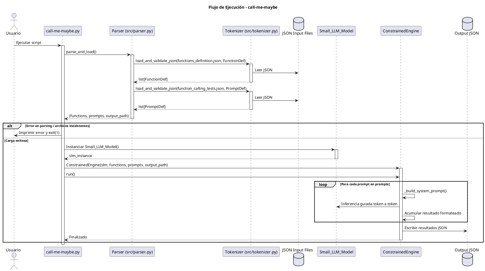
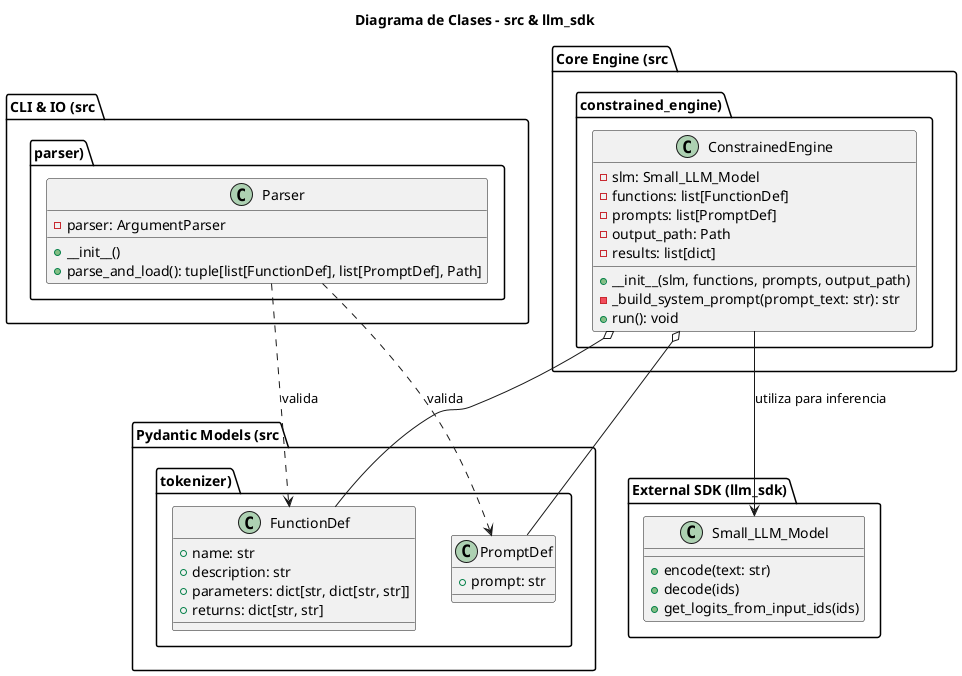

*This project has been created as part of the 42 curriculum by agalvan-.*

# Call Me Maybe - Function Calling Engine

<div align="center">
  <h1> LLM SDK for Local Inference</h1>
  <p><em>A lightweight, efficient, and professional Python SDK for Hugging Face Causal Language Models</em></p>
  <p><strong>Author:</strong> agalvan-</p>
</div>

---
```python
import os

for fname in ['call-me-maybe.py', 'tokenizer.py', 'parser.py', 'constrained_engine.py']:
    if os.path.exists(fname):
        print(f"=== {fname} ===")
        with open(fname) as f:
            print(f.read()[:1000])


```

```text
=== call-me-maybe.py ===
#!/usr/bin/env python3
"""Main entry point for the constrained function calling engine."""

import sys
import time
from json import JSONDecodeError

from llm_sdk import Small_LLM_Model
from src import ConstrainedEngine, Parser


def main() -> None:
    """
    Execute the parsing, initialization, and run phases of the engine.

    Parses input constraints and prompts, initializes the language model
    instance, and runs the constrained generation pipeline. Gracefully
    handles exceptions by printing error messages and exiting safely.
    """

    try:
        parser = Parser()
        functions, prompts, output_path = parser.parse_and_load()
    except (OSError, ValueError, JSONDecodeError) as e:
        print(f"\033[1;31mError - {e} \033[0m")
        sys.exit(1)

    try:
        slm_instance = Small_LLM_Model()
        engine = ConstrainedEngine(
            slm=slm_instance,
            functions=functions,
            prompts=prompts,
            output_path=output_path
        
=== tokenizer.py ===
import json
from pathlib import Path

from pydantic import BaseModel, ValidationError


class FunctionDef(BaseModel):
    """Pydantic model to validate function definitions."""
    name: str
    description: str
    parameters: dict[str, dict[str, str]]
    returns: dict[str, str]

class PromptDef(BaseModel):
    """Pydantic model to validate input prompts."""
    prompt: str

def load_and_validate_json[T: BaseModel](filepath: Path,
                                         model: type[T]) -> list[T]:
    """
    Loads a JSON file and validates its content against a Pydantic model.
    Catches file reading and validation exceptions to prevent crashes.
    """
    try:
        with open(filepath, "r", encoding="utf-8") as f:
            raw_data = json.load(f)
        
        return [model(**item) for item in raw_data]
    
    except FileNotFoundError:
        print(f"Error: File {filepath} does not exist.")
        return []
    except json.JSONDecodeError as e:
        print(f"Error:
=== parser.py ===
import argparse
from pathlib import Path

from .tokenizer import FunctionDef, PromptDef
from .tokenizer import load_and_validate_json as lvj


class Parser:
    """Manages CLI arguments and handles the validated loading of JSON files."""
    
    def __init__(self) -> None:
        self.parser = argparse.ArgumentParser(description="Function Calling LLM Tool")
        self.parser.add_argument(
            "--functions_definition", 
            type=Path, 
            default=Path("data/input/functions_definition.json")
        )
        self.parser.add_argument(
            "--input", 
            type=Path, 
            default=Path("data/input/function_calling_tests.json")
        )
        self.parser.add_argument(
            "--output", 
            type=Path, 
            default=Path("data/output/function_calling_results.json")
        )

    def parse_and_load(self) -> tuple[list[FunctionDef], list[PromptDef], Path] | None:
        """Parses arguments and returns the validated d
=== constrained_engine.py ===
"""Module for generating constrained JSON outputs from a small language model."""

import json
import re
from pathlib import Path
from typing import Any

import numpy as np

from llm_sdk import Small_LLM_Model
from src.tokenizer import FunctionDef, PromptDef


class ConstrainedEngine:
    """Engine for generating constrained JSON outputs from an LLM."""

    def __init__(
        self,
        slm: Small_LLM_Model,
        functions: list[FunctionDef],
        prompts: list[PromptDef],
        output_path: Path
    ) -> None:
        """Initialize the ConstrainedEngine."""
        self.slm = slm
        self.functions = functions
        self.prompts = prompts
        self.output_path = output_path
        self.results: list[dict[str, Any]] = []

    def _build_system_prompt(self, prompt_text: str) -> str:
        """Ultra-compressed prompt with a single master example for zero-shot precision."""
        fn_lines: list[str] = []
        for fn in self.functions:
            props = fn.


```

# 🚀 call-me-maybe: Constrained Function Calling Engine

> **Proyecto:** Constrained Function Calling Engine for Small Language Models (SLM)
> **Gestor de Entorno:** Docker + `uv` (Astral)
> **Linter & Type Checking:** `flake8` + `mypy`

---

## 📑 Tabla de Contenidos

* [📖 Descripción del Proyecto](https://www.google.com/search?q=%23-descripci%C3%B3n-del-proyecto)
* [📊 Diagramas de Arquitectura y Flujo (PlantUML)](https://www.google.com/search?q=%23-diagramas-de-arquitectura-y-flujo-plantuml)
* [1. Diagrama de Secuencia y Flujo de Ejecución](https://www.google.com/search?q=%231-diagrama-de-secuencia-y-flujo-de-ejecuci%C3%B3n)
* [2. Diagrama de Clases del Sistema](https://www.google.com/search?q=%232-diagrama-de-clases-del-sistema)
* [3. Diagrama del Entorno Docker y Volúmenes](https://www.google.com/search?q=%233-diagrama-del-entorno-docker-y-vol%C3%BAmenes)


* [📁 Estructura del Proyecto](https://www.google.com/search?q=%23-estructura-del-proyecto)
* [💻 Análisis Técnico de Componentes](https://www.google.com/search?q=%23-an%C3%A1lisis-t%C3%A9cnico-de-componentes)
* [🐳 Análisis del Entorno Docker (`Dockerfile`)](https://www.google.com/search?q=%23-an%C3%A1lisis-del-entorno-docker-dockerfile)
* [⚙️ Automatización y Comandos (`Makefile`)](https://www.google.com/search?q=%23%EF%B8%8F-automatizaci%C3%B3n-y-comandos-makefile)
* [🚀 Guía de Instalación y Uso](https://www.google.com/search?q=%23-gu%C3%ADa-de-instalaci%C3%B3n-y-uso)

---

## 📖 Descripción del Proyecto

`call-me-maybe` es un motor de inferencia guiada diseñado para forzar a Modelos de Lenguaje Pequeños (*Small Language Models* - SLM) a generar estructuras JSON estrictas y válidas correspondientes a llamadas a funciones (*Function Calling*).

El sistema valida las definiciones de las funciones y los *prompts* de entrada mediante esquemas **Pydantic**, construye prompts de sistema optimizados (zero-shot) y ejecuta una generación restringida token por token utilizando la abstracción `Small_LLM_Model`.

---

## 📊 Diagramas de Arquitectura y Flujo (PlantUML)

### 1. Diagrama de Secuencia y Flujo de Ejecución

El siguiente diagrama detalla la secuencia lógica completa desde que se lanza `call-me-maybe.py` hasta la escritura final de los resultados JSON:



---

### 2. Diagrama de Clases del Sistema

Estructura de clases y modelos de datos validados con Pydantic dentro de la arquitectura del motor:



---

### 3. Diagrama del Entorno Docker y Volúmenes

Mapeo de arquitectura entre el sistema anfitrión (*Host*) y el contenedor de desarrollo gestionado mediante el `Makefile`:

```plantuml
@startuml
title Arquitectura del Entorno de Contenedores

node "Host System (Linux / macOS / WSL)" {
    folder "$(pwd)" as HostWorkspace
    folder "$(HOME)/.cache/huggingface" as HostHFCache
    file "Makefile" as HostMake
}

node "Docker Container (call-me-maybe-dev)" {
    node "Base Image: python:3.12-slim" {
        agent "Astral uv 0.5.11" as UV
        user "appuser (UID 1000)" as AppUser
        folder "/app" as ContainerApp
        folder "/root/.cache/huggingface" as ContainerCache
        folder "/home/appuser/.venv" as Venv
    }
}

HostWorkspace <==> ContainerApp : Mount (-v $(pwd):/app:z)
HostHFCache <==> ContainerCache : Mount (-v HF_CACHE)
HostMake ..> UV : Ejecuta 'uv run' / 'uv sync'
AppUser --> Venv : Entorno de ejecución de Python

@enduml

```

---

## 📁 Estructura del Proyecto

```text
.
├── Dockerfile                  # Configuración de imagen basada en python:3.12-slim y uv
├── Makefile                    # Automatización de tareas de desarrollo, linting y Docker
├── pyproject.toml              # Definición del proyecto y dependencias de uv
├── uv.lock                     # Lockfile exacto de dependencias de Python
├── call-me-maybe.py            # Punto de entrada principal (main script)
├── constrained_engine.py       # Lógica del motor de generación restringida
├── parser.py                   # Parser de argumentos CLI y carga de configuración
├── tokenizer.py                # Modelos Pydantic (FunctionDef, PromptDef) y carga JSON
├── data/
│   ├── input/
│   │   ├── functions_definition.json
│   │   └── function_calling_tests.json
│   └── output/
│       └── function_calling_results.json
└── README.md                   # Documentación técnica del proyecto

```

---

## 💻 Análisis Técnico de Componentes

### 1. `call-me-maybe.py`

Punto de entrada (*entrypoint*). Coordina las 3 fases del proceso:

* **Fase 1 (Parsing & Validation):** Instancia `Parser` y obtiene los datos validados. Captura errores de I/O, `ValueError` y `JSONDecodeError`.
* **Fase 2 (Model Init):** Inicializa la instancia `Small_LLM_Model()`.
* **Fase 3 (Engine Execution):** Construye `ConstrainedEngine` y arranca la generación guiada.

### 2. `tokenizer.py`

Define la validación de esquema basada en **Pydantic**:

* `FunctionDef`: Garantiza que cada función contenga `name`, `description`, `parameters` y `returns`.
* `PromptDef`: Valida las entradas de pruebas.
* `load_and_validate_json()`: Función genérica tipada (`[T: BaseModel]`) que carga el archivo JSON y lo deserializa de forma segura evitando caídas inesperadas (*crashes*).

### 3. `parser.py`

Procesa las opciones de línea de comandos (`argparse`):

* `--functions_definition`: Ruta del esquema de funciones (por defecto `data/input/functions_definition.json`).
* `--input`: Ruta de las pruebas de entrada (por defecto `data/input/function_calling_tests.json`).
* `--output`: Ruta de guardado de los resultados (por defecto `data/output/function_calling_results.json`).

### 4. `constrained_engine.py`

Implementa la lógica del motor de inferencia:

* Construye *prompts* de sistema estructurados para guiar la salida hacia formatos JSON válidos.
* Interactúa con el modelo `Small_LLM_Model` procesando logits y restringiendo tokens válidos.

---

## 🐳 Análisis del Entorno Docker (`Dockerfile`)

El `Dockerfile` sigue buenas prácticas de contenedores optimizados e inmunes a ejecuciones con privilegios innecesarios:

```dockerfile
FROM python:3.12-slim

# Instalación de 'uv' desde la imagen oficial de Astral
COPY --from=ghcr.io/astral-sh/uv:0.5.11 /uv /uvx /bin/

# Variables de entorno para optimizar ejecución de Python y uv
ENV PYTHONDONTWRITEBYTECODE=1 \
    PYTHONUNBUFFERED=1 \
    UV_LINK_MODE=copy \
    UV_COMPILE_BYTECODE=1 \
    UV_PROJECT_ENVIRONMENT=/home/appuser/.venv

# Creación de usuario sin privilegios root
RUN useradd -m appuser
WORKDIR /app

# Copia de archivos con permisos ajustados
COPY --chown=appuser:appuser . /app

USER appuser

ENV PATH="/app/.venv/bin:$PATH"
CMD ["python", "call-me-maybe.py"]

```

### Puntos clave del `Dockerfile`:

1. **Base Ligera (`python:3.12-slim`):** Reduce la huella en disco y la superficie de vulnerabilidades.
2. **Uso de `uv` (Astral 0.5.11):** Gestión ultra-rápida de entornos virtuales y dependencias en Rust en lugar de `pip` tradicional.
3. **Usuario Seguro (`appuser`):** Evita la ejecución del proceso interno como `root`.
4. **Caché de bytecode precompilada (`UV_COMPILE_BYTECODE=1`):** Acelera el tiempo de arranque del contenedor.

---

## ⚙️ Automatización y Comandos (`Makefile`)

El `Makefile` abstrae la complejidad de la gestión de contenedores Docker, volúmenes de caché y verificación de código estático.

---

## 🚀 Guía de Instalación y Uso

### 1. Requisitos Previos

* Linux, macOS o WSL2 en Windows.
* Docker instalado y en ejecución.
* `GNU Make`.

### 2. Construcción del Entorno

Para construir la imagen Docker sin necesidad de instalar Python ni dependencias en la máquina local:

```bash
make build

```

### 3. Ejecución del Proyecto

Para sincronizar dependencias automáticamente e iniciar la generación restringida de funciones:

```bash
make run

```

### 4. Control de Calidad del Código (Linter)

Antes de enviar o presentar el código, ejecutar el chequeo de tipos y cumplimiento de estilo:

```bash
make lint

```

Para una verificación estricta:

```bash
make lint-strict

```

### 5. Limpieza Completa

Para eliminar todos los contenedores, imágenes y residuos de caché generados:

```bash
make clean

```
