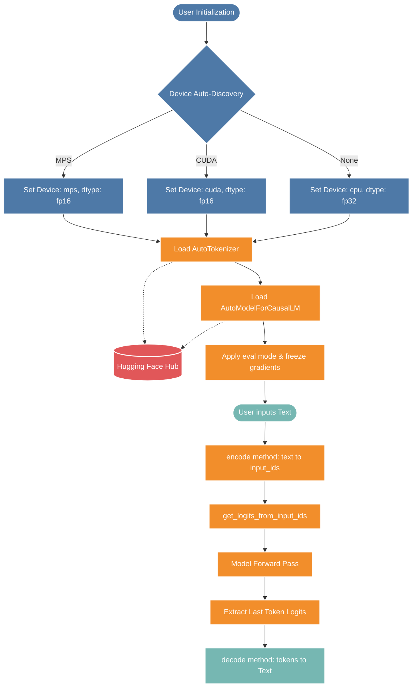

*This project has been created as part of the 42 curriculum by agalvan-.*

# Call Me Maybe - Function Calling Engine

<div align="center">
  <h1> LLM SDK for Local Inference</h1>
  <p><em>A lightweight, efficient, and professional Python SDK for Hugging Face Causal Language Models</em></p>
  <p><strong>Author:</strong> agalvan-</p>
</div>

---

## Table of Contents

* [Theoretical Base](#-theoretical-base)
* [Model Used](#-model-used)
* [Code Explanation](#-code-explanation)
* [Deployment and Configuration](#️-deployment-and-configuration)
 * [Make Commands](#make-commands)
 * [Docker Environment](#docker-environment)

---

##  Theoretical Base

Large Language Models (LLMs) operate on the fundamental principle of **Causal Language Modeling (CLM)**. In CLM, the model is trained to predict the next token in a sequence given all previous tokens. This auto-regressive generation is the backbone of modern conversational AI.

### Inference vs. Training
While training an LLM requires massive computational resources to compute gradients and update weights, **inference** is the process of using a pre-trained model to generate text. To optimize for inference on consumer-grade hardware:
- **Quantization and Data Types**: Using reduced precision (`float16`) instead of full precision (`float32`) halves the memory bandwidth requirements and VRAM consumption without significantly degrading output quality.
- **Gradient Computation Disabled**: By setting `requires_grad = False` and invoking `.eval()` mode, we prevent PyTorch from building a computational graph, drastically reducing memory overhead.

### Hardware Acceleration
Modern local inference relies heavily on hardware acceleration. The SDK is designed to automatically detect and route tensor operations to the most efficient device available:
1. **Apple Silicon (MPS)**: Metal Performance Shaders for macOS.
2. **NVIDIA GPUs (CUDA)**: Compute Unified Device Architecture for parallel processing.
3. **CPU**: Fallback for environments lacking dedicated AI accelerators.

---

##  Model Used

By default, the SDK utilizes **`Qwen/Qwen3-0.6B`**. 

### Why Qwen3-0.6B?
- **Lightweight Footprint**: With approximately 0.6 Billion parameters, it easily fits into the memory of standard laptops and edge devices.
- **Fast Experimentation**: Ideal for rapid prototyping, CI/CD pipelines, and local testing without the latency of API calls.
- **Architecture**: A state-of-the-art transformer decoder designed with grouped-query attention (GQA) and optimized positional embeddings.

*Note: The SDK is model-agnostic and can load any Causal LM available on the Hugging Face Hub by simply overriding the `model_name` parameter.*

---

##  Code Explanation

The core of the SDK is encapsulated in the `Small_LLM_Model` class. Below is a detailed technical breakdown of its components.

### Program Flow Diagram
The following Mermaid schema illustrates the end-to-end execution flow from instantiation to text decoding:



### Core Methods Summary

<table style="width:100%; border-collapse: collapse; font-family: Arial, sans-serif; box-shadow: 0 4px 8px rgba(0,0,0,0.1);">
  <thead>
    <tr style="background-color: #2c3e50; color: #ffffff; text-align: left;">
      <th style="padding: 12px; border: 1px solid #ddd;">Method Name</th>
      <th style="padding: 12px; border: 1px solid #ddd;">Parameters</th>
      <th style="padding: 12px; border: 1px solid #ddd;">Returns</th>
      <th style="padding: 12px; border: 1px solid #ddd;">Description</th>
    </tr>
  </thead>
  <tbody>
    <tr style="background-color: #f8f9fa;">
      <td style="padding: 12px; border: 1px solid #ddd; font-weight: bold; color: #d35400;"><code>__init__</code></td>
      <td style="padding: 12px; border: 1px solid #ddd;"><code>model_name, device, dtype, trust_remote_code</code></td>
      <td style="padding: 12px; border: 1px solid #ddd;"><code>None</code></td>
      <td style="padding: 12px; border: 1px solid #ddd;">Initializes the model, auto-discovers optimal hardware, sets dtypes, and locks gradients for inference.</td>
    </tr>
    <tr style="background-color: #ffffff;">
      <td style="padding: 12px; border: 1px solid #ddd; font-weight: bold; color: #2980b9;"><code>encode</code></td>
      <td style="padding: 12px; border: 1px solid #ddd;"><code>text (str)</code></td>
      <td style="padding: 12px; border: 1px solid #ddd;"><code>torch.Tensor</code></td>
      <td style="padding: 12px; border: 1px solid #ddd;">Tokenizes raw text strings into a 2D tensor of integers mapped to the configured device.</td>
    </tr>
    <tr style="background-color: #f8f9fa;">
      <td style="padding: 12px; border: 1px solid #ddd; font-weight: bold; color: #27ae60;"><code>decode</code></td>
      <td style="padding: 12px; border: 1px solid #ddd;"><code>ids (Tensor | list[int])</code></td>
      <td style="padding: 12px; border: 1px solid #ddd;"><code>str</code></td>
      <td style="padding: 12px; border: 1px solid #ddd;">Translates token IDs back into human-readable text, stripping special system tokens.</td>
    </tr>
    <tr style="background-color: #ffffff;">
      <td style="padding: 12px; border: 1px solid #ddd; font-weight: bold; color: #8e44ad;"><code>get_logits_...</code></td>
      <td style="padding: 12px; border: 1px solid #ddd;"><code>input_ids (list[int])</code></td>
      <td style="padding: 12px; border: 1px solid #ddd;"><code>list[float]</code></td>
      <td style="padding: 12px; border: 1px solid #ddd;">Performs a memory-efficient forward pass (no_grad) and extracts raw un-normalized logits for the next token prediction.</td>
    </tr>
    <tr style="background-color: #f8f9fa;">
      <td style="padding: 12px; border: 1px solid #ddd; font-weight: bold; color: #c0392b;"><code>get_path_to_...</code></td>
      <td style="padding: 12px; border: 1px solid #ddd;"><code>None</code></td>
      <td style="padding: 12px; border: 1px solid #ddd;"><code>str</code></td>
      <td style="padding: 12px; border: 1px solid #ddd;">Downloads and caches vocabulary/merges/tokenizer configuration files directly from the Hugging Face Hub.</td>
    </tr>
  </tbody>
</table>

---

##  Deployment and Configuration

This SDK uses modern Python packaging defined via `pyproject.toml` (Hatchling backend).

### Prerequisites
- Python >= 3.10
- PyTorch >= 2.0.0
- Transformers >= 4.40.0

### Make Commands

To streamline the development workflow, the following standard Makefile targets are recommended (ensure you have a `Makefile` in your root directory):

```bash
# Setup the virtual environment and install the SDK in editable mode
make install

# Run code debuggind (e.g., gdb or bash)
make debugg | make shell


# Clean cached files, __pycache__ or docker image
make clean
```

### Docker Environment

For isolated and reproducible inference environments, use a containerized approach. Below is a conceptual representation of the Docker setup.

**Dockerfile**
```dockerfile
# Base image with Python 3.10 and PyTorch
FROM pytorch/pytorch:2.0.1-cuda11.7-cudnn8-runtime

# Set working directory
WORKDIR /app

# Copy project files
COPY pyproject.toml .
COPY llm_sdk/ ./llm_sdk/

# Install the SDK using pip
RUN pip install --no-cache-dir -e .

# Default entrypoint
CMD ["python", "-c", "from llm_sdk import Small_LLM_Model; model = Small_LLM_Model(); print('SDK Initialized Successfully!')"]
```

**Build and Run Commands:**
```bash
# Build the Docker image
docker build -t llm-sdk:latest .

# Run the container with GPU support
docker run --gpus all -it llm-sdk:latest
```

---

