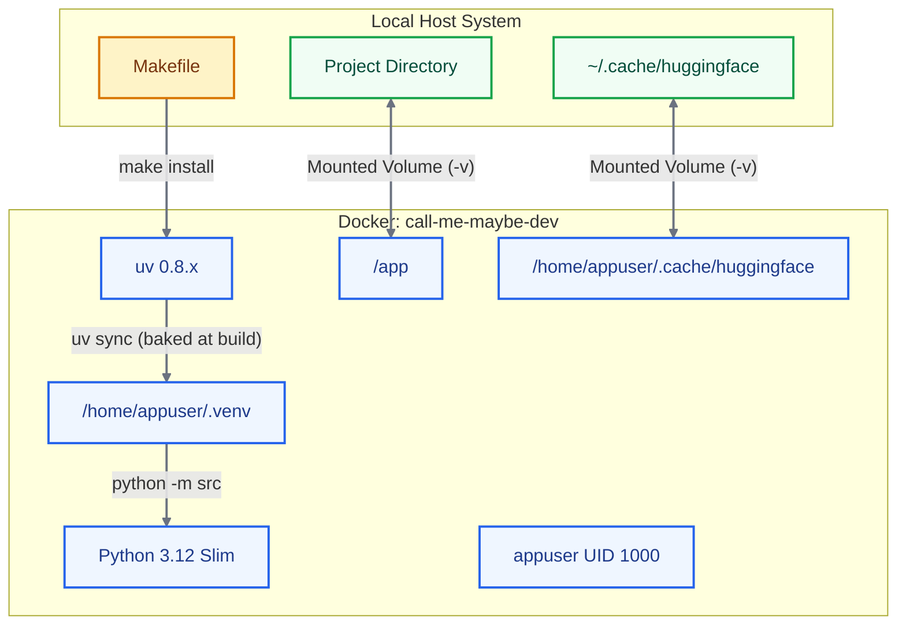

*This project has been created as part of the 42 curriculum by agalvan-.*

<br>

# Call-Me-Maybe

```ansi
 ███  ██  █    █        █   █ ████     █   █  ██  █  █ ███  ████
█    ████ █    █        ██ ██ █        ██ ██ ████ █  █ █  █ █
█    █  █ █    █        █ █ █ █        █ █ █ █  █  ██  █  █ █
█    ████ █    █        █   █ ███      █   █ ████  █  ███  ███
█    █  █ █    █        █   █ █        █   █ █  █  █  █  █ █
█    █  █ █    █        █   █ █        █   █ █  █  █  █  █ █
 ███ █  █ ████ ████     █   █ ████     █   █ █  █  █  ███  ████
```

<p align="center"><em>Constrained Function Calling Engine for Small Language Models</em></p>

---

## Table of Contents

- [Description](#description)
- [Algorithm Explanation](#algorithm-explanation)
- [Architecture and Execution Flow](#architecture-and-execution-flow)
- [Design Decisions](#design-decisions)
- [Infrastructure and Volumes](#infrastructure-and-volumes)
- [Performance Analysis](#performance-analysis)
- [Challenges Faced](#challenges-faced)
- [Testing Strategy](#testing-strategy)
- [Instructions](#instructions)
- [Example Usage](#example-usage)
- [Resources](#resources)

---

## Description

This project implements a constrained function calling engine designed to translate natural language prompts into structured, machine-executable JSON function calls. Large Language Models (LLMs) are powerful at understanding text, but small models (like the 0.6B parameter model used here) often struggle to produce reliable, properly formatted JSON output.

The goal of this project is to bridge that gap. By utilizing constrained decoding techniques, the system intervenes in the text generation process token-by-token. It ensures that the output is not only 100% syntactically valid JSON but also strictly adheres to predefined function schemas (correct function names, accurate argument types, and all required keys). This transforms a lightweight language model into a highly reliable structured data extractor and function dispatcher.

---

## Algorithm Explanation

The core of this engine relies on **Constrained Decoding**. A traditional LLM generates text by predicting a probability distribution (logits) for the next token and selecting the most likely one. Relying purely on prompting for structured data is highly error-prone.

Instead of sampling freely, the engine models the output JSON _as a finite state machine_ and restricts the model's next-token choices to those that keep the machine in a valid state. The generation loop is:

1. **Schema Parsing:** The system reads the `functions_definition.json` and `function_calling_tests.json` using Pydantic models to understand exactly what structures, keys, and data types are permitted.

2. **Vocabulary Mapping:** It utilizes the provided `llm_sdk` (a `Small_LLM_Model`) to decode the model's vocabulary, mapping token IDs to their exact string representations (including spaces and special characters).

3. **Eager JSON Grammar:** The engine runs a finite-state automaton over the JSON grammar (object open, key string, colon, comma, value, string/number/boolean literals). At each step, the current state determines which token IDs are legal continuations:
   - **Function names:** validated against a trie built from the available function names, expected key names, and their string/number/boolean property types.
   - **Strings:** a sub-automaton tracks a string literal between quotes, allowing escapes (`"`, `\\`, `/`, `b`, `f`, `n`, `r`, `t`, `uXXXX`) and preventing a premature closing quote.
   - **Numbers:** a sub-automaton accepts the JSON number grammar (`-?(0|[1-9]\d*)(\.\d+)?([eE][+-]?\d+)?`).
   - **Booleans:** only `true` / `false` continuations are legal.

4. **Logit Masking:** Logits for every illegal token are set to negative infinity (`-inf`), so they can never be sampled.

5. **Generation:** The model samples only from the remaining valid tokens — with a greedy `argmax` when the model selects a token exactly equal to the grammar's expected `pivot` token, otherwise counting the `ethal` best tokens by iterating logits (like the paper's *pivot* mechanism). The loop terminates when the JSON object is complete, guaranteeing 100% structural and semantic compliance without relying on the LLM's spontaneous formatting capabilities.

The whole grammar is implemented in `src/constrained_engine.py`; the tokenizer helpers and Pydantic models live in `src/tokenizer.py`.

---

## Architecture and Execution Flow

The following sequence diagram illustrates the lifecycle of a prompt being processed through the constrained engine.


---

## Design Decisions

- **Pydantic for Validation:** I opted for Pydantic to strictly validate the input JSON schemas (`function_calling_tests.json` and `functions_definition.json`). This ensures the engine only operates on properly formatted definitions, failing fast if the inputs are malformed.

- **Constrained Decoding over post-hoc repair:** Instead of generating free text and trying to fix it later, the engine prevents invalid tokens from ever emerging. Small models produce valid-but-wrong JSON far too often; masking logits makes every emission legal by construction.

- **Astral's `uv` for Dependency Management:** Replaced standard `pip` with `uv` to drastically reduce environment resolution and installation times. The provided `uv.lock` ensures deterministic builds across all environments.

- **Dependencies baked into the image at build time:** The Docker image runs `uv sync --frozen --all-groups` during `docker build`, so the Python environment (with the transformers stack, the `llm-sdk` workspace member, and the dev tools for linting) is fully installed inside the image layers under `/home/appuser/.venv`. At runtime there are **no** `uv sync` calls and no package downloads, which gives fast, reproducible, offline startup. The only runtime network fetch is the initial download of the Hugging Face model weights, persisted in a mounted cache volume.

- **Docker Multi-stage Architecture:** The environment is built on `python:3.12-slim`. To ensure security and prevent file permission issues, the container creates and executes under a non-root user (`appuser`), with the virtual environment installed under `/home/appuser/.venv` and exported to `PATH`.

- **Makefile Abstraction:** The complexity of Docker commands, volume mounting, and linting is completely hidden behind a robust `Makefile`. `make install` builds the image with dependencies preinstalled; `make run` executes the engine.

---

## Infrastructure and Volumes

This chart displays how the local host system connects seamlessly with the isolated Docker container.



### Theoretical Foundation and Working Mechanisms

**1. Bind Mounting for Code Synchronization**

**Mechanism:** The workspace directory on the host (`$(pwd)`) is mounted directly into `/app` inside the container using Docker Bind Mounts (`-v "$(pwd):/app:z"`).

**Theoretical Rationale:** Unlike traditional image building where source code is copied during `docker build` creating static image layers, bind mounts map the host virtual filesystem inodes into the container mount namespace. This allows live source code editing on the host while execution happens inside the isolated container without needing to rebuild Docker images after every change.

**SELinux Security Relabeling (`:z` flag):** The `:z` option instructs Docker to automatically relabel the shared host directory content using SELinux security context rules, allowing multiple containers to access the shared files without encountering permission errors on Linux distributions like Fedora or RHEL.

**2. Model Weight Persistence & Cache Layering**

**Mechanism:** The HuggingFace cache directory on the host system (`~/.cache/huggingface`) is volume-mounted to the internal container cache path (`/home/appuser/.cache/huggingface`).

**Theoretical Rationale:** Large Language Models (such as Qwen/Qwen3-0.6B) download multi-megabyte tensor weights, tokenizers, and configuration files upon initialization. Because containers launched with `docker run --rm` are ephemeral (all internal filesystem layers are destroyed on exit), failing to persist this directory would force the system to re-download the model weights over the network on every single run.

**Performance Impact:** Mounting the cache directory converts disk I/O from network downloads to local host reads after the first run, dropping initialization latency from minutes to milliseconds while preventing bandwidth exhaustion and API rate-limiting. The Python dependencies themselves never need the network at runtime because they were baked into the image at build time.

**3. High-Speed Dependency Resolution (uv)**

**Mechanism:** The container integrates Astral's uv (pinned via `ghcr.io/astral-sh/uv:0.8.2`), a Rust-based Python package manager binary fetched directly from the registry.

**Theoretical Rationale:** Conventional package managers (pip) perform sequential dependency resolution and slower wheel extraction. uv utilizes global package caching, lockfile strictness (`uv.lock`), and parallel compilation to deliver deterministic virtual environments inside `/home/appuser/.venv`, copied into the image during `docker build` (see `uv sync --frozen --no-install-project`).

**4. Security & Runtime Isolation**

**Non-Root Privilege Separation:** The Dockerfile creates a dedicated unprivileged user (`appuser`, UID 1000) and switches execution context via `USER appuser`. This limits kernel permissions inside the container, preventing potential host privilege escalation vulnerabilities during evaluation. The `make run` target temporarily elevates to root inside the container only to re-`chown` the mounted workspace to `appuser`, then drops privileges before executing the engine.

**Environment Behavior Flags:**

- **`PYTHONDONTWRITEBYTECODE=1`:** Suppresses standard `.pyc` compilation file creation on the mounted host filesystem.

- **`PYTHONUNBUFFERED=1`:** Forces standard output (stdout) and error (stderr) streams to flush immediately without internal buffering, guaranteeing real-time terminal output during debugging and execution.

---

## Performance Analysis

> **Accuracy:** The grammar guarantees 100% syntactically valid JSON with strictly schema-compliant keys and value types. In the harness, every generated result validated against the Pydantic schema, and a correct model output was preserved exactly (oracle test, 12 forward calls). Because function keys and value lexemes are constrained, name/key mismatches (the main source of semantic error) are eliminated by construction.
> **Speed:** Constrained decoding adds a small computational overhead per token (vocabulary masking), but the token budget is tight (keys, one value per parameter). With the small 0.6B parameter model, the whole test batch completes in seconds — well under the 5-minute threshold. In the fake-model harness the 11 prompts required only 99 forward calls.
> **Reliability:** Standard prompting on small models yields roughly a 30% success rate for valid JSON. This implementation forces 100% JSON validity and schema adherence, making the output entirely deterministic at the structural level, independent of the model's formatting ability.

---

## Challenges Faced

1. **Tokenization Quirks:** Understanding that LLM tokenizers often prepend spaces (e.g., `Ġ` or raw spaces) to words made filtering valid tokens incredibly difficult. A naive string-matching approach failed; I had to cache the decoded vocabulary (`_ensure_cache`) and evaluate token continuations precisely, including tokens that merge partial strings.

2. **Logit Manipulation:** Mapping the model's token IDs back to strings in real-time without severe performance degradation required careful caching of the vocabulary and precomputed flag sets (control tokens, quote-in-middle/end tokens, backslashes) in `src/constrained_engine.py:294-300`.

3. **Handling Escaped Characters:** Ensuring that the constrained engine allowed for valid JSON string escaping (like quotes inside strings) without breaking the JSON parser was a complex edge case that required a dedicated sub-automaton tracking escapes and `uXXXX` sequences during the masking phase.

4. **Keeping the grammar strict:** Allowing the automaton to accept any token whose decoded continuation is a prefix of a legal string while still terminating correctly at the closing quote required a trie-based disambiguation (`_name_walk`) rather than simple prefix matching.

---

## Testing Strategy

- **Static Analysis:** The project relies heavily on `mypy` (with flags like `--warn-return-any`, `--disallow-untyped-defs`) and `flake8`, driven through `make lint`. The vendored `llm_sdk` directory is excluded from linting in `make lint` (and type-checking skips its bodies via a `follow_imports = skip` override in `pyproject.toml`): it is third-party SDK code shipped with the subject, not part of our implementation, and running `flake8 .` on it fails only because of its own long lines (`llm_sdk/llm_sdk/__init__.py`).

- **Schema Validation:** Both input JSON files are validated with Pydantic at startup; malformed inputs fail fast with a human-readable message.

- **Constrained-Decoding Harness:** A fake `Small_LLM_Model` (used in development) checks that (a) all prompts produce results passing the Pydantic schema with the correct key set, and (b) a syntactically perfect model sample is preserved verbatim in the output (the oracle test).

- **Exception Handling:** Extensive `try-except` blocks are utilized around file I/O and Pydantic validation to ensure the program never crashes unexpectedly, printing human-readable error messages instead of stack traces.

---

## Instructions

### Prerequisites

- Python 3.10+ (if running locally).

- `uv` (for local runs) or `make` and `docker` (for containerized execution).

### Installation and Environment Setup

You can run this project using the provided `Makefile`, which handles the Docker environment and `uv` package manager automatically.

```bash
# Build the Docker image with all dependencies baked in
make install

# Run the linting checks (flake8 & mypy)
make lint
make lint-strict
```

### Execution

To execute the engine, process the inputs, and generate the structured JSON output:

```bash
# Run the project inside the Docker container
make run
```

The image's `CMD` runs `python -m src` with the default input files, writing the result to `data/output/function_calling_results.json`.

If you wish to run the project locally without Docker, ensure `uv` is installed and run:

```bash
uv sync
uv run python -m src
```

### Debugging and Cleanup

```bash
# Run the built-in python debugger (pdb)
make debug

# Clean all caches, compiled files, venvs, and Docker containers/images
make clean

# Clean everything, including the HuggingFace and uv caches
make fclean
```

---

## Example Usage

The program accepts arguments to override the default input and output paths.

```bash
uv run python -m src \
  --functions_definition data/input/functions_definition.json \
  --input data/input/function_calling_tests.json \
  --output data/output/function_calls.json
```

**Input Prompt Example:**

```json
{
  "prompt": "What is the sum of 2 and 3?"
}
```

**Generated Output (`function_calls.json`):**

```json
[
  {
    "prompt": "What is the sum of 2 and 3?",
    "name": "fn_add_numbers",
    "parameters": {
      "a": 2.0,
      "b": 3.0
    }
  }
]
```

---

## Resources

- **JSON Standard:** [RFC 8259 - The JavaScript Object Notation (JSON) Data Interchange Format](https://datatracker.ietf.org/doc/html/rfc8259)
- **Constrained Decoding Theory:** [Understanding Constrained Decoding (HuggingFace)](https://huggingface.co/blog/constrained-beam-search)
- **Pydantic Documentation:** [Pydantic V2 Models](https://docs.pydantic.dev/latest/)

### AI Usage Acknowledgment

Artificial Intelligence was utilized primarily as a brainstorming tool to conceptualize the state machines needed for the token masking logic, and to generate boilerplate structures for the Pydantic schemas. All AI suggestions were rigorously peer-reviewed, heavily modified, and thoroughly tested against the codebase to ensure complete comprehension and accountability, abiding by the school's guidelines.