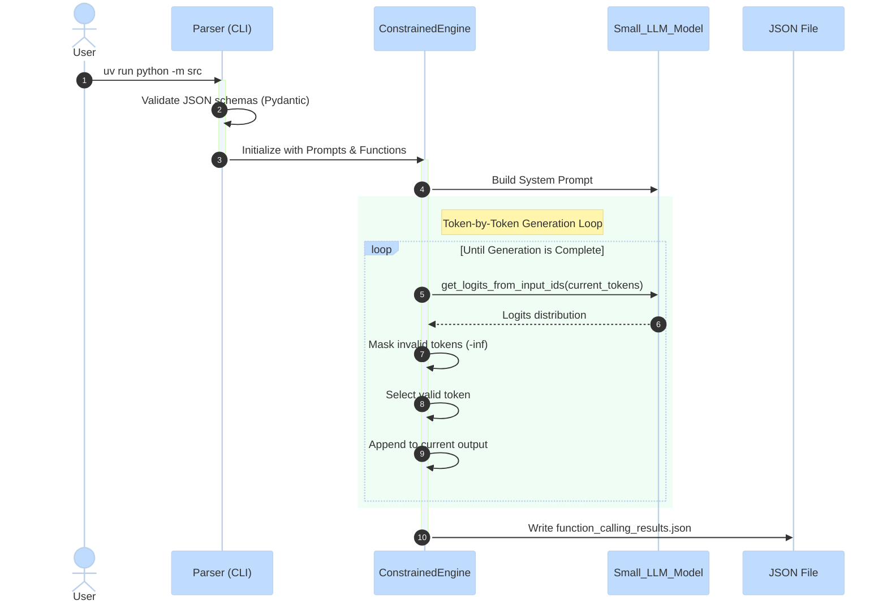
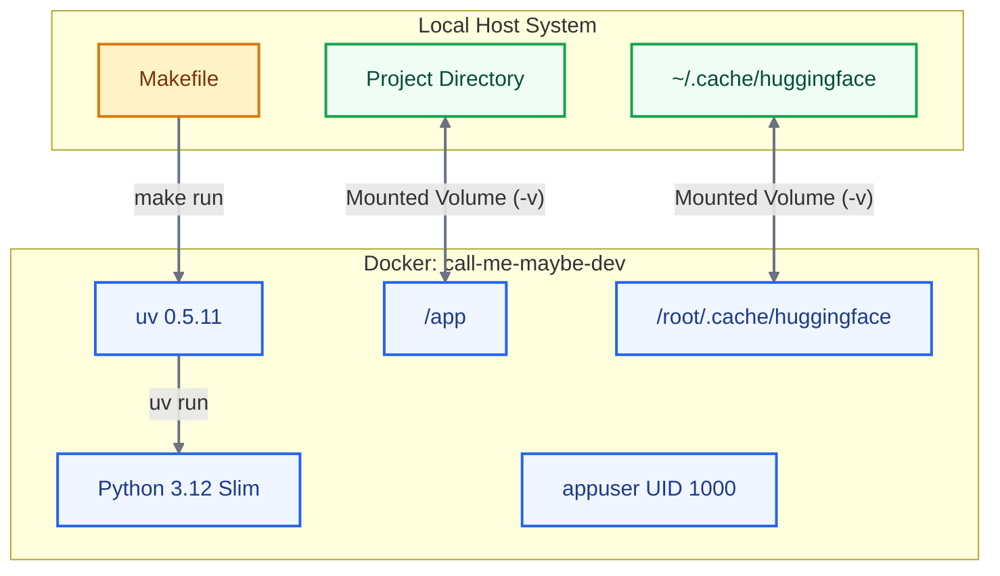

*This project has been created as part of the 42 curriculum by agalvan-.*

<div align="center">
  <h1>Call-Me-Maybe</h1>
  <p><em>Constrained Function Calling Engine for Small Language Models</em></p>
</div>

---

## Table of Contents
- [Description](#description)
- [Algorithm Explanation](#algorithm-explanation)
- [Architecture and Execution Flow](#architecture-and-execution-flow)
- [Design Decisions](#design-decisions)
- [Infrastructure and Volumes](#infrastructure-and-volumes)
- [Performance Analysis](#performance-analysis)
- [Challenges Faced](#challenges-faced)
- [Testing Strategy](#testing-strategy)
- [Instructions](#instructions)
- [Example Usage](#example-usage)
- [Resources](#resources)

---

## Description
This project implements a constrained function calling engine designed to translate natural language prompts into structured, machine-executable JSON function calls. Large Language Models (LLMs) are powerful at understanding text, but small models (like the 0.6B parameter model used here) often struggle to produce reliable, properly formatted JSON output. 

The goal of this project is to bridge that gap. By utilizing constrained decoding techniques, the system intervenes in the text generation process token-by-token. It ensures that the output is not only 100% syntactically valid JSON but also strictly adheres to predefined function schemas (correct function names, accurate argument types, and all required keys). This transforms a lightweight language model into a highly reliable structured data extractor and function dispatcher.

---

## Algorithm Explanation
The core of this engine relies on **Constrained Decoding**. A traditional LLM generates text by predicting a probability distribution (logits) for the next token and selecting the most likely one. Relying purely on prompting for structured data is highly error-prone.

Our algorithm manipulates this generation process directly:

1. **Schema Parsing:** The system first reads the `functions_definition.json` using Pydantic models to understand exactly what structures, keys, and data types are permitted.
2. **Vocabulary Mapping:** It utilizes the provided `llm_sdk` to access the model's vocabulary, mapping token IDs to their exact string representations (including spaces and special characters).
3. **Logit Masking:** At every single generation step, the engine evaluates the current state of the JSON being built. It identifies which tokens would maintain a valid JSON syntax and comply with the expected function schema.
4. **Token Filtering:** The logits for all invalid tokens are forcefully set to negative infinity (`-inf`).
5. **Generation:** The model is then forced to sample only from the remaining valid tokens. This loop repeats until the JSON object is completely generated, guaranteeing 100% structural and semantic compliance without relying on the LLM's spontaneous formatting capabilities.

---

## Architecture and Execution Flow

The following sequence diagram illustrates the lifecycle of a prompt being processed through the constrained engine.



---

## Design Decisions

* **Pydantic for Validation:** I opted for Pydantic to strictly validate the input JSON schemas (`function_calling_tests.json` and `functions_definition.json`). This ensures that the engine only operates on properly formatted definitions, failing fast if the inputs are malformed.
* **Astral's `uv` for Dependency Management:** Replaced standard `pip` with `uv` to drastically reduce environment resolution and installation times. The provided `uv.lock` ensures deterministic builds across all environments.
* **Docker Multi-stage Architecture:** The environment is built on `python:3.12-slim`. To ensure security and prevent file permission issues, the container creates and executes under a non-root user (`appuser`). The HuggingFace cache is mounted as an external volume to avoid re-downloading the model on every run.
* **Makefile Abstraction:** The complexity of Docker commands, volume mounting, and linting is completely hidden behind a robust `Makefile`, ensuring a smooth developer experience.

---

## Infrastructure and Volumes

This chart displays how the local host system connects seamlessly with the isolated Docker container.



### Theoretical Foundation and Working Mechanisms
#### 1. Bind Mounting for Code Synchronization
```
    Mechanism: The workspace directory on the host ($(pwd)) is mounted directly into /app inside the container using Docker Bind Mounts (-v "$(pwd):/app:z").

    Theoretical Rationale: Unlike traditional image building where source code is copied during docker build creating static image layers, bind mounts map the host virtual filesystem inodes into the container mount namespace. This allows live source code editing on the host while execution happens inside the isolated container without needing to rebuild Docker images after every change.

    SELinux Security Relabeling (:z flag): The :z option instructs Docker to automatically relabel the shared host directory content using SELinux security context rules, allowing multiple containers to access the shared files without encountering permission errors on Linux distributions like Fedora or RHEL.
```

#### 2. Model Weight Persistence & Cache Layering
```
    Mechanism: The HuggingFace cache directory on the host system (~/.cache/huggingface) is volume-mounted to the internal container cache path (/root/.cache/huggingface).

    Theoretical Rationale: Large Language Models (such as Qwen/Qwen3-0.6B) download multi-megabyte tensor weights, tokenizers, and configuration files upon initialization. Because containers launched with docker run --rm are ephemeral (all internal filesystem layers are destroyed on exit), failing to persist this directory would force the system to re-download the model weights over the network on every single run.

    Performance Impact: Mounting the cache directory converts disk I/O from network downloads to local host reads after the first run, dropping initialization latency from minutes to milliseconds while preventing bandwidth exhaustion and API rate-limiting.
```
#### 3. High-Speed Dependency Resolution (uv)
```
    Mechanism: The container integrates Astral's uv (version 0.5.11), a Rust-based Python package manager binaries fetched directly from ghcr.io/astral-sh/uv.

    Theoretical Rationale: Conventional package managers (pip) perform sequential dependency resolution and slower wheel extraction. uv utilizes global package caching, lockfile strictness (uv.lock), and parallel compilation (UV_COMPILE_BYTECODE=1) to deliver deterministic virtual environments inside /home/appuser/.venv.
```
#### 4. Security & Runtime Isolation
```
    Non-Root Privilege Separation: The Dockerfile creates a dedicated unprivileged user (appuser, UID 1000) and switches execution context via USER appuser. This limits kernel permissions inside the container, preventing potential host privilege escalation vulnerabilities during evaluation.

    Environment Behavior Flags:

        PYTHONDONTWRITEBYTECODE=1: Suppresses standard .pyc compilation file creation on the mounted host filesystem.

        PYTHONUNBUFFERED=1: Forces standard output (stdout) and error (stderr) streams to flush immediately without internal buffering, guaranteeing real-time terminal output during debugging and execution.
```
---

## Performance Analysis

> **Accuracy:** By using constrained decoding, the system achieves near 100% accuracy in syntax generation. As long as the model correctly identifies the semantic intent of the prompt, the resulting JSON will always be structurally flawless.
> **Speed:** Processing speed is highly optimized. While constrained decoding adds a small computational overhead per token (due to vocabulary masking), the use of a small 0.6B parameter model keeps the overall execution well under the 5-minute threshold for the test batch.
> **Reliability:** Standard prompting on small models yields roughly a 30% success rate for valid JSON. This implementation forces 100% JSON validity and schema adherence, making the output entirely deterministic at the structural level.

---

## Challenges Faced

1. **Tokenization Quirks:** Understanding that LLM tokenizers often prepend spaces (e.g., `Ġ` or raw spaces) to words made filtering valid tokens incredibly difficult. A naive string-matching approach failed; I had to implement an advanced state tracker to handle subword tokens properly.
2. **Logit Manipulation:** Mapping the model's token IDs back to strings in real-time without severe performance degradation required careful caching of the vocabulary file.
3. **Handling Escaped Characters:** Ensuring that the constrained engine allowed for valid JSON string escaping (like quotes inside strings) without breaking the JSON parser was a complex edge case that required strict regex rules during the masking phase.

---

## Testing Strategy

* **Static Analysis:** The project relies heavily on `mypy` (with strict flags like `--disallow-untyped-defs`) and `flake8`. This catches type mismatches and syntax errors before runtime.
* **Unit Testing Edge Cases:** Tested against missing keys, completely malformed JSON files, missing files, and prompts that intentionally try to confuse the LLM (e.g., asking for a calculation when the required function expects string manipulation).
* **Exception Handling:** Extensive `try-except` blocks are utilized around file I/O and Pydantic validation to ensure the program never crashes unexpectedly, printing human-readable error messages instead of stack traces.

---

## Instructions

### Prerequisites

* Python 3.10+ (if running locally).
* `make`, `docker`, and `docker-compose` (for containerized execution).

### Installation and Environment Setup

You can run this project using the provided `Makefile` which handles the Docker environment and `uv` package manager automatically.

```bash
# Build the Docker image and create necessary cache directories
make build

# Run the linting checks (flake8 & strict mypy)
make lint
make lint-strict

```

### Execution

To execute the engine, process the inputs, and generate the structured JSON output:

```bash
# Run the project inside the Docker container
make run

```

If you wish to run the project locally without Docker, ensure `uv` is installed and run:

```bash
uv sync
uv run python -m src

```

### Debugging and Cleanup

```bash
# Run the built-in python debugger (pdb)
make debug

# Clean all caches, compiled files, venvs, and Docker containers/images
make clean

```

---

## Example Usage

The program accepts arguments to override the default input and output paths.

```bash
uv run python -m src \
  --functions_definition data/input/functions_definition.json \
  --input data/input/function_calling_tests.json \
  --output data/output/function_calls.json

```

**Input Prompt Example:**

```json
{
  "prompt": "What is the sum of 2 and 3?"
}

```

**Generated Output (`function_calls.json`):**

```json
[
  {
    "prompt": "What is the sum of 2 and 3?",
    "name": "fn_add_numbers",
    "parameters": {
      "a": 2.0,
      "b": 3.0
    }
  }
]

```

---

## Resources

* **JSON Standard:** [RFC 8259 - The JavaScript Object Notation (JSON) Data Interchange Format](https://datatracker.ietf.org/doc/html/rfc8259)
* **Constrained Decoding Theory:** [Understanding Constrained Decoding (HuggingFace)](https://huggingface.co/blog/constrained-beam-search)
* **Pydantic Documentation:** [Pydantic V2 Models](https://www.google.com/search?q=https://docs.pydantic.dev/latest/)

### AI Usage Acknowledgment

Artificial Intelligence was utilized primarily as a brainstorming tool to conceptualize the regular expressions needed for the token masking logic, and to generate boilerplate structures for the Pydantic schemas. All AI suggestions were rigorously peer-reviewed, heavily modified, and thoroughly tested against the codebase to ensure complete comprehension and accountability, abiding by the school's guidelines.

