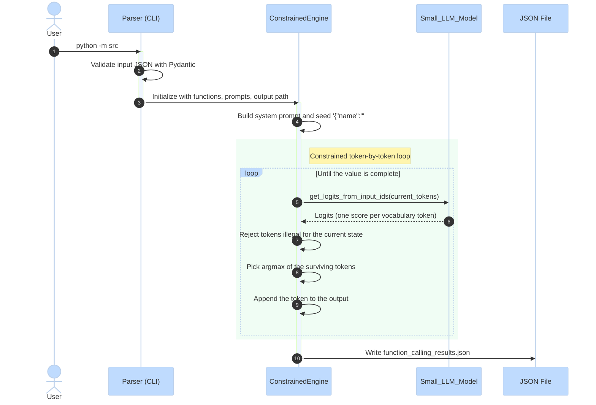
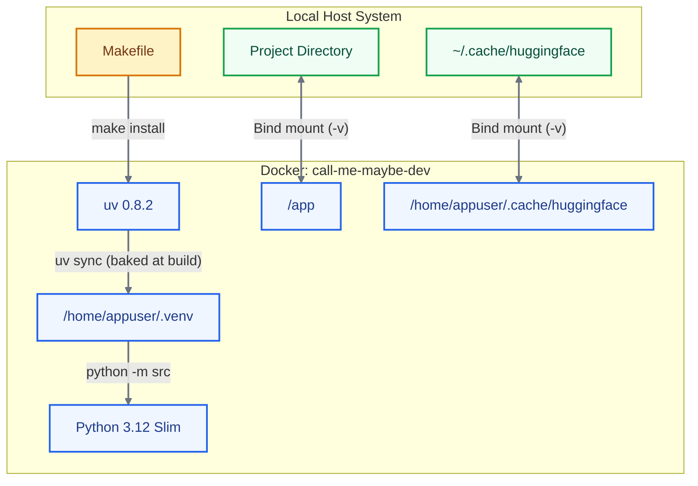

*This project has been created as part of the 42 curriculum by agalvan-.*

<br>

# Call-Me-Maybe

```ansi
 ███  ██  █    █        █   █ ████     █   █  ██  █  █ ███  ████
█    ████ █    █        ██ ██ █        ██ ██ ████ █  █ █  █ █
█    █  █ █    █        █ █ █ █        █ █ █ █  █  ██  █  █ █
█    ████ █    █        █   █ ███      █   █ ████  █  ███  ███
█    █  █ █    █        █   █ █        █   █ █  █  █  █  █ █
█    █  █ █    █        █   █ █        █   █ █  █  █  █  █ █
 ███ █  █ ████ ████     █   █ ████     █   █ █  █  █  ███  ████
```

<p align="center"><em>Constrained Function Calling Engine for Small Language Models</em></p>

---

## Table of Contents

- [Description](#description)
- [Key Concepts and Glossary](#key-concepts-and-glossary)
- [How the Engine Works](#how-the-engine-works)
- [Architecture and Execution Flow](#architecture-and-execution-flow)
- [Project Structure](#project-structure)
- [Design Decisions](#design-decisions)
- [Infrastructure and Volumes](#infrastructure-and-volumes)
- [Performance Analysis](#performance-analysis)
- [Testing Strategy](#testing-strategy)
- [Instructions](#instructions)
- [Example Usage](#example-usage)
- [Resources](#resources)

---

## Description

This project implements a **constrained function calling engine** that translates natural language prompts into structured, machine-executable JSON function calls.

Large Language Models are good at understanding text, but **small** models — the project uses `Qwen/Qwen3-0.6B`, a 0.6-billion-parameter model — are unreliable at emitting strictly formatted JSON. Left to itself, the model produces something *close* to JSON: a missing comma, a trailing bracket, a number spelled as two separate tokens, a key that does not exist in the schema. Such output cannot be handed to a program.

The goal is to close that gap without post-processing. Instead of generating free text and trying to repair it afterwards, the engine **intervenes in the decoding loop**: at every step it knows which tokens are legal, and it removes the rest from the running. The output is therefore valid JSON and schema-compliant *by construction*, not by luck.

The result is that a lightweight model — one that could not produce a valid function call on its own — behaves as a deterministic, reliable structured-data extractor and function dispatcher.

---

## Key Concepts and Glossary

Terms used throughout this README, defined once so the rest of the document needs no assumption of prior knowledge.

### Language models

| Term | Meaning |
| --- | --- |
| **LLM (Large Language Model)** | A neural network trained on a large text corpus to predict the next token. "Large" refers to parameter count (billions). |
| **SLM (Small Language Model)** | A deliberately small LLM, typically under 1–2 billion parameters. Runs fast on CPU but has much weaker formatting and reasoning ability. This project targets exactly this weakness. |
| **Parameter** | One learned weight in the network. `Qwen3-0.6B` has roughly 600 million. |
| **Causal LM** | A model that only looks at previous tokens, never at future ones, when predicting the next one. |
| **Inference** | Running a trained model to produce an output (as opposed to training it). |
| **Forward pass** | One full run of the model over the current token sequence, producing the prediction for the next token. Each generated token costs one forward pass, and the cost grows with sequence length because there is no KV cache in this implementation. |

### Tokens and tokenization

| Term | Meaning |
| --- | --- |
| **Token** | The smallest unit a model reads and writes. Roughly a word, a word fragment, or a punctuation mark. |
| **Token ID** | The integer that identifies a token in the model's vocabulary (e.g. `872` may mean `" numbers"`). |
| **Vocabulary** | The fixed set of all tokens a model knows. `Qwen3-0.6B` has about 152,000. |
| **Tokenizer** | The component that converts text to token IDs and back. It is *not* a language model: it contains no understanding, only reversible rules. Different tokenizers split text differently, which is why this engine must reason about token boundaries. |
| **Leading-space behaviour** | Many tokenizers encode a word *with* its preceding space as a single token (`" numbers"`). Consequently a bare `"numbers"` and `" numbers"` are **different token IDs**. This engine must strip whitespace before comparing token text against a grammar. |
| **Vocabulary cache** | Decoding all ~152,000 token IDs once and storing the resulting strings in a list, so per-step lookups are a list index instead of a tokenizer call. Built lazily in `ConstrainedEngine._ensure_cache` (`src/constrained_engine.py:62`). |

### Decoding

| Term | Meaning |
| --- | --- |
| **Logits** | The raw, unnormalised scores the model assigns to every token in the vocabulary for the next position. A higher logit means "more likely". They are not probabilities. |
| **Softmax** | The function that converts logits into a probability distribution that sums to 1. This engine does not need it. |
| **Greedy decoding (argmax)** | Always pick the token with the highest logit. Deterministic: same input, same output. This engine uses greedy decoding exclusively. |
| **Sampling** | Picking a token at random according to the probability distribution, which makes output non-deterministic. This engine never samples. |
| **Temperature / top-k / top-p** | Common knobs that make a model more or less random. Not used here — determinism is a requirement. |
| **Constrained decoding** | Restricting the candidate set at each decoding step to tokens that keep the output valid for a target format. The technique this project is about. |
| **Grammar** | A precise description of which strings are legal. For JSON, the specification is RFC 8259. |
| **Automaton (finite state machine)** | A model of "what may legally come next" as a set of states plus transitions. The engine uses small, purpose-built sub-automata for numbers, booleans, and string bodies, rather than one machine for the entire document. |

### Structured output and tooling

| Term | Meaning |
| --- | --- |
| **Function calling** | An application pattern where a model is given a catalogue of functions and must answer with *which* function to call and *with what arguments*, instead of free text. This project generates that answer. |
| **JSON** | A text format for structured data (`{"key": value}`). This project always emits a JSON **array of objects**, one per prompt. |
| **JSON Schema** | A machine-readable description of the legal shape of a JSON document. This project's schemas are supplied in a simplified custom form (`data/input/functions_definition.json`) rather than full JSON Schema. |
| **Pydantic** | A Python library that defines a data model and validates data against it. Used here to check the two **input** files at startup, so malformed input fails fast instead of producing garbage later. |
| **Type coercion** | Converting a generated value to the type the schema declares — e.g. the text `"2"` to the integer `2`. Implemented in `_coerce_value` (`src/constrained_engine.py:330`). |

### Build and runtime

| Term | Meaning |
| --- | --- |
| **Docker image** | A packaged filesystem plus a runtime configuration, built once and reused. |
| **Container** | A running instance of an image, with its own isolated process namespace. |
| **Bind mount (`-v host:container`)** | Mapping a path on the host into the container. Edits on the host are visible inside immediately, with no rebuild. |
| **Image layer** | Each step in a `Dockerfile` produces one layer, cached and reused across builds. This project installs dependencies in a single layer precisely so that layer is cached. |
| **`:z` (SELinux relabeling)** | A mount option that relabels the shared files for SELinux-based systems, so a container can read a host directory without permission errors. |
| **`uv`** | Astral's fast Python package manager and project manager. |
| **Workspace member** | A local package included in a `uv` workspace. Here `llm_sdk` is a local workspace member resolved from disk rather than from a package index. |
| **`uv.lock`** | The resolved, exact dependency set. Passing `--frozen` guarantees the build uses exactly these versions. |
| **`.venv`** | A project's isolated Python environment. In the image it lives at `/home/appuser/.venv`. |
| **Model cache** | Where downloaded model weights are stored. Persisting it across runs avoids re-downloading hundreds of megabytes. |

---

## How the Engine Works

### The core idea

A language model produces **one token at a time**. At each step it emits a score for every token in its vocabulary, and normally you pick the highest one. The problem is that, in a JSON document, most of those tokens are illegal at any given moment: after `{"a":` you may not emit a letter to start a key, and after a complete number you may not emit another digit unless the number grammar allows it.

The engine removes illegal tokens from the running at every step. Two facts make this practical:

1. **The engine writes the skeleton itself.** It never asks the model to produce braces, colons, commas, or parameter names. It writes those fragments directly, and asks the model only for the *values*.
2. **What remains is a small, well-defined problem.** The only things the model must generate are a function name, and one value per parameter. Each of those has a simple legality test.

### What the engine writes vs. what the model writes

This split is the heart of the design:

| Written by the engine (never by the model) | Written by the model (constrained) |
| --- | --- |
| `{`, `}`, `[`, `]`, `,`, `:` | Function name, e.g. `fn_add_numbers` |
| Parameter names, e.g. `"source_string"` | Number values, e.g. `265` |
| Quotation marks around keys and string values | Boolean values, `true` / `false` |
| The system prompt and its few-shot examples | String contents, e.g. `Hello 34 I'm 233 years old` |

Because the engine owns the skeleton, **parameter names and value types can never be wrong**. The model cannot invent `paramaters` or emit a string where a number belongs, because it is never asked to choose either.

### The generation loop, step by step

For each prompt, the engine performs the following:

1. **Build the context.** Compose a system prompt listing every available function with its parameter names, plus two worked examples, ending with `User: <prompt>` and `Assistant:`. The model now has everything it needs to decide *what* to say, and nothing it needs in order to decide *how* to format it.

2. **Seed the output.** Append `{"name":"`. The model must now emit a function name.

3. **Generate the function name** (`_gen_name`, `src/constrained_engine.py:167`). A token is legal only if the text accumulated so far is still a prefix of at least one known function name. Two shortcuts keep this cheap:
   - if exactly one name is still viable, the remaining characters are appended without calling the model at all;
   - if the accumulated text is already a complete name and no other name extends it, generation stops.

4. **Append `","parameters":{`** and walk the chosen function's parameters in schema order.

5. **Generate each value**, using a generator matched to the declared type. The engine first writes `"<key>":` and, for strings, the opening quote.

   - **Numbers** (`_gen_number`, `src/constrained_engine.py:207`) are checked against the JSON number grammar `-?(0|[1-9][0-9]*)(\.[0-9]+)?([eE][+-]?[0-9]+)?`, with each candidate token classified as *valid*, *still-valid-so-far*, or *invalid*. The stopping rule is the interesting part: small models spell `265` as `2` then `65`, so stopping at the first syntactically valid number would truncate it. Instead the engine keeps going **while the model's own preferred token would still form a valid number**, and stops as soon as the model wants to emit something else — a comma, a brace, whitespace. The decision to stop is therefore the model's, not the engine's.
   - **Booleans** (`_gen_bool`, `src/constrained_engine.py:240`) are restricted to continuations of `true` or `false`.
   - **Strings** (`_gen_string`, `src/constrained_engine.py:267`) are restricted to characters legal inside a JSON string, with a sub-state tracking escape sequences (`\"`, `\\`, `\/`, `\b`, `\f`, `\n`, `\r`, `\t`, `\uXXXX`) and rejecting raw control characters. The engine also knows which characters must follow the closing quote, so a token is accepted only if it either leaves the string open, or closes it in a position from which the required JSON can still be completed.
   - **After every value**, values are passed through `_coerce_value` so that a number declared as `"type": "number"` is emitted as a JSON number, not as a quoted string.

6. **Assemble and export.** The generated token IDs are decoded back to text, the result is written to `data/output/function_calling_results.json`, and the engine prints the elapsed time.

### How a token is selected

At each step, selection happens in `_pick` (`src/constrained_engine.py:55`):

1. The engine asks the SDK for the raw logits of the next token and copies them into a NumPy array.
2. The indices of every illegal token are set to `-inf` **in that copy**.
3. `argmax` returns the surviving token with the highest score.

Three properties follow, and they matter:

- The model's own output is never modified; only the engine's working copy is masked. Nothing is cached, renormalised, or fed back into the model.
- Selection is **greedy and deterministic** — no sampling, no temperature. The same prompt and the same model always produce the same function call.
- The mask is a *filter*, not a guarantee. If every token were excluded, `argmax` would return an arbitrary index; the generators therefore always have a valid fallback completion if the generated text drifts outside the legal set.

---

## Architecture and Execution Flow


```mermaid
%%{init: {'theme': 'base', 'themeVariables': { 'primaryColor': '#dbeafe', 'edgeColor': '#3b82f6', 'actorBkg': '#bfdbfe', 'activationBkgColor': '#eff6ff'}}}%%
sequenceDiagram
    autonumber
    actor User as User
    participant CLI as Parser (CLI)
    participant Engine as ConstrainedEngine
    participant SDK as Small_LLM_Model
    participant Output as JSON File

    User->>CLI: python -m src
    activate CLI
    CLI->>CLI: Validate input JSON with Pydantic
    CLI->>Engine: Initialize with functions, prompts, output path
    deactivate CLI

    activate Engine
    Engine->>Engine: Build system prompt and seed '{"name":"'

    rect rgb(240, 253, 244)
        note right of Engine: Constrained token-by-token loop
        loop Until the value is complete
            Engine->>SDK: get_logits_from_input_ids(current_tokens)
            SDK-->>Engine: Logits (one score per vocabulary token)
            Engine->>Engine: Reject tokens illegal for the current state
            Engine->>Engine: Pick argmax of the surviving tokens
            Engine->>Engine: Append the token to the output
        end
    end

    Engine->>Output: Write function_calling_results.json
    deactivate Engine
```

---

## Project Structure

```
.
├── call-me-maybe.py            # Compatibility entry point (delegates to src.__main__)
├── Dockerfile                  # Multi-stage image; dependencies baked in at build time
├── Makefile                    # Wraps every docker / uv / lint command
├── pyproject.toml              # Dependencies, lint and type-check configuration
├── data/
│   ├── input/
│   │   ├── functions_definition.json     # The function catalogue (the "schema")
│   │   └── function_calling_tests.json   # The prompts to answer (11 of them)
│   └── output/                 # Generated results (git-ignored)
├── llm_sdk/                    # Vendored third-party SDK (a uv workspace member)
│   └── llm_sdk/__init__.py     # Small_LLM_Model: load, encode, decode, get_logits
└── src/
    ├── __main__.py             # Entry point: parse, build model, run, report timing
    ├── __init__.py             # Re-exports the public API
    ├── parser.py               # CLI arguments + validated loading of the input files
    ├── tokenizer.py            # Pydantic models (FunctionDef, PromptDef) + JSON loader
    └── constrained_engine.py   # The engine itself
```

`llm_sdk` is third-party code shipped with the assignment; it is excluded from linting and its bodies are skipped by the type checker (see [Testing Strategy](#testing-strategy)).

---

## Design Decisions

- **Constrained decoding over post-hoc repair.** The alternative — generate freely, then fix the JSON with a parser or a second pass — was rejected. Repair after the fact cannot know what the model *meant*, and small models fail often enough that the repair layer becomes the real program. Masking tokens means every emission is legal by construction.

- **The engine owns the skeleton.** Letting the model generate keys and punctuation would be more "pure" constrained decoding, but it would give the model many more ways to fail on a 0.6B model. Writing the skeleton directly removes an entire class of errors and shrinks the problem given to the model to the part it is actually good at: choosing a value.

- **A sub-automaton per value type, not one machine for the document.** A full JSON automaton is elegant but the states that matter here are few and local: is the next character a valid number so far, is this a legal string body, is a `\` escape pending. Three small, testable functions express that more clearly than one large state enum.

- **Let the model decide where a number ends.** Stopping at the first valid number is grammatically correct but semantically wrong for small models. Deferring to the model's own top token keeps multi-digit values intact while staying deterministic.

- **Pydantic for input validation.** Validating the two input files at startup means a malformed catalogue fails immediately with a readable message, instead of producing nonsense output after a model load.

- **`uv` instead of `pip`.** Faster resolution, and `uv.lock` pins exact versions so a build months from now produces the same environment.

- **Dependencies baked into the image at build time.** `docker build` runs `uv sync --frozen --all-groups`, so the runtime, the `llm-sdk` workspace member, and the dev tools for linting are all installed inside the image. At runtime there are **no** `uv sync` calls and no package downloads, which gives fast, reproducible, offline startup. The only network access at runtime is the first download of the model weights, which is then persisted in a mounted cache.

- **Multi-stage, non-root image.** Built on `python:3.12-slim`, with the environment at `/home/appuser/.venv` and `PATH` exported so `python` resolves to the project environment. The image declares `USER appuser`; note that `make run` overrides this with `--user 0:0` so it can re-own the bind-mounted host directory before starting, and the engine therefore runs as **root** inside the container. That is deliberate — the container is short-lived and has no host privileges beyond the mounted paths — but it is worth stating plainly rather than claiming a privilege drop that does not happen.

- **Makefile as the single interface.** Docker flags, volume mounts, and lint flags are hidden behind `make` targets, so the project is used the same way regardless of host.

---

## Infrastructure and Volumes


```mermaid
graph TD
    classDef host fill:#f0fdf4,stroke:#16a34a,stroke-width:2px,color:#064e3b;
    classDef container fill:#eff6ff,stroke:#2563eb,stroke-width:2px,color:#1e3a8a;
    classDef tool fill:#fef3c7,stroke:#d97706,stroke-width:2px,color:#78350f;

    subgraph HostSystem["Local Host System"]
        HostDIR["Project Directory"]:::host
        HostCache["~/.cache/huggingface"]:::host
        Makefile["Makefile"]:::tool
    end

    subgraph DockerContainer["Docker: call-me-maybe-dev"]
        Python["Python 3.12 Slim"]:::container
        UV["uv 0.8.2"]:::container
        AppDIR["/app"]:::container
        Venv["/home/appuser/.venv"]:::container
        ContainerCache["/home/appuser/.cache/huggingface"]:::container
    end

    HostDIR <-->|"Bind mount (-v)"| AppDIR
    HostCache <-->|"Bind mount (-v)"| ContainerCache
    Makefile -->|"make install"| UV
    UV -->|"uv sync (baked at build)"| Venv
    Venv -->|"python -m src"| Python

    linkStyle default stroke:#6b7280,stroke-width:2px;
```

### 1. Bind mounting for code synchronization

**Mechanism:** the project directory on the host (`$(pwd)`) is mounted at `/app` inside the container via `-v "$(pwd):/app:z"`.

**Why:** during `docker build` the source is *copied* into an image layer — a snapshot. A bind mount instead maps the host's files into the container's mount namespace, so editing code on the host is immediately visible inside the running container with no rebuild. The `:z` option relabels the shared files for SELinux systems, avoiding permission errors on Fedora/RHEL hosts.

**Consequence:** because the code is not baked in, the image does not need rebuilding for code changes. Only dependency changes do.

### 2. Model weight persistence

**Mechanism:** `~/.cache/huggingface` on the host is mounted at `/home/appuser/.cache/huggingface` in the container.

**Why:** the first run downloads the tokenizer, config, and weights for `Qwen/Qwen3-0.6B`. Containers started with `docker run --rm` are ephemeral — every layer is destroyed on exit — so without this mount the weights would be re-downloaded on every single run. After the first run this turns a network transfer into a local disk read.

### 3. Dependency resolution with `uv`

**Mechanism:** `uv` (pinned to `ghcr.io/astral-sh/uv:0.8.2`) is copied from a build stage into the final image, and `uv sync --frozen --all-groups` runs once during `docker build` into `/home/appuser/.venv`.

**Why:** `pip` resolves dependencies sequentially and extracts wheels slowly. `uv` is written in Rust, uses a global cache, and enforces the exact versions in `uv.lock`. `--frozen` means the lockfile is used as-is and never re-resolved, so the build is reproducible. Baking this into one layer means the expensive step is cached until `pyproject.toml` or `uv.lock` actually change.

### 4. Runtime flags

- **`PYTHONDONTWRITEBYTECODE=1`** — do not write `.pyc` files onto the bind-mounted host directory. Keeps the host tree clean and avoids root-owned cache files appearing in a user-owned repository.
- **`UV_PROJECT_ENVIRONMENT`** — tells `uv` to place the environment at `/home/appuser/.venv` rather than `/app/.venv`, keeping it out of the bind mount.
- **`PYTHONUNBUFFERED`** is not required for the engine, but interactive targets benefit from unbuffered output while debugging.

---

## Performance Analysis

> **Validity.** The engine guarantees valid JSON and schema compliance by construction: the skeleton, the parameter names, and the value types are all written by the engine rather than chosen by the model. The generated output therefore always contains exactly the keys the selected function declares, with values coerced to their declared types. The 0.6B model determines *which* function to call and *what* the values are, but it cannot determine the shape.
>
> **Speed.** Every generated token costs one forward pass, and the number of generated tokens is bounded by the schema (a name, plus one value per parameter). The whole batch of 11 prompts completes well within the 5-minute threshold, on CPU, without a GPU. The main cost is the initial model load and the first-run weight download; afterwards the mounted cache makes startup fast.
>
> **Determinism.** Decoding is greedy — `argmax` over the surviving tokens, with no sampling and no temperature — so the same prompt always yields the same function call. This makes behaviour reproducible and diffable.
>
> **Accuracy.** Constrained decoding guarantees *structural* correctness, not *semantic* correctness. The engine guarantees that the output is well-formed and schema-compliant; it cannot guarantee that `fn_get_square_root` is the right function for a given prompt. That choice is the model's, and a 0.6B model will get some prompts wrong. Constrained decoding removes the formatting failure mode; it does not add reasoning ability.

---

## Testing Strategy

- **Static analysis.** `make lint` runs `flake8` and `mypy` over the project and passes cleanly. `make lint-strict` re-runs both with `mypy --strict`, which is stricter than the project's own configuration: it flags the two Pydantic models in `src/tokenizer.py` for subclassing an untyped `BaseModel` (a consequence of Pydantic's dynamic typing, not a defect in this code). `flake8` reads its configuration (`max-line-length = 80`, excludes) from `[tool.flake8]` in `pyproject.toml` via the `flake8-pyproject` plugin, and `mypy` reads its flags from `[tool.mypy]`.

- **Third-party code is excluded.** `llm_sdk` is skipped by `flake8` (via `exclude` and `--extend-exclude`) and by `mypy` (via `follow_imports = "skip"`). It is SDK code shipped with the assignment, not part of this implementation, and it contains lines longer than this project's 80-character limit.

- **Input validation.** Both input files are validated with Pydantic at startup. A missing file, malformed JSON, or a schema mismatch prints a readable message and exits with status 1 rather than producing invalid output.

- **Round-trip validation of the generated document.** After each prompt the engine decodes the generated token IDs back into text and parses that text with `json.loads`. Because the engine writes the structural skeleton itself, the document is valid JSON by construction; the parse confirms it rather than repairing it, and any parameters parsed from the result are re-coerced to their declared types. If the parse ever fails — for instance if the model emits a token sequence that decodes to an unparseable string — the engine falls back to the per-parameter values it collected during generation, so a function call is always produced.

- **Structural coverage.** The engine's leaf-value generators (`_gen_number`, `_gen_bool`, `_gen_string`, `_string_token`, `_num_status`) are pure functions of their inputs and of a token vocabulary, so the constrained-decoding behaviour can be exercised deterministically against a fake `Small_LLM_Model` — no model download and no GPU required. This is how the number, boolean, and string sub-automata, the escape handling, and the assembly of the final document are validated.

- **Error handling.** File I/O and validation are wrapped so that failures produce human-readable messages instead of stack traces.

---

## Instructions

### Prerequisites

- `make` and Docker, for the containerized workflow (the supported path).
- Alternatively, `uv` and Python 3.10+ for local runs. Note that the `llm-sdk` dependency pulls in PyTorch, which may not provide wheels for every Python version.

### Installation

```bash
make install   # build the image with all dependencies baked in
```

### Execution

```bash
make run       # run the engine inside the container
```

Results are written to `data/output/function_calling_results.json`, and the elapsed time is printed on completion.

### Available targets

| Target | Description |
| --- | --- |
| `make install` | Build the Docker image (`docker build`), dependencies included. |
| `make run` | Run the engine against the default input files. |
| `make shell` | Open an interactive shell inside the image. |
| `make debug` | Run the engine under `pdb` for interactive debugging. |
| `make lint` | Run `flake8` and `mypy` with the project's configured flags. |
| `make lint-strict` | Same, with `mypy --strict`. |
| `make clean` | Remove caches, `__pycache__`, generated output, and the Docker image and containers. |
| `make fclean` | `clean`, plus the HuggingFace and `uv` caches. |

### Running locally without Docker

```bash
uv sync
uv run python -m src
```

### Debugging and cleanup

```bash
make debug     # python -m pdb -m src
make clean     # build artefacts, images, containers
make fclean    # the above, plus downloaded weights and package caches
```

---

## Example Usage

The program accepts arguments to override the default input and output paths.

```bash
uv run python -m src \
  --functions_definition data/input/functions_definition.json \
  --input data/input/function_calling_tests.json \
  --output data/output/function_calls.json
```

**Input prompt** (`data/input/function_calling_tests.json`):

```json
{
  "prompt": "What is the sum of 2 and 3?"
}
```

**Generated output** (`function_calls.json`):

```json
[
    {
        "prompt": "What is the sum of 2 and 3?",
        "name": "fn_add_numbers",
        "parameters": {
            "a": 2,
            "b": 3
        }
    }
]
```

Note that `a` and `b` are emitted as JSON numbers, not as strings, and always as integers when the generated text contains no decimal point or exponent — `_coerce_value` uses `int()` in that case and `float()` otherwise.

For a function with several parameters, the keys always appear in the order the function declares them:

```json
{
    "prompt": "Replace all numbers in \"Hello 34 I'm 233 years old\" with NUMBERS",
    "name": "fn_substitute_string_with_regex",
    "parameters": {
        "source_string": "Hello 34 I'm 233 years old",
        "regex": "\\d+",
        "replacement": "NUMBERS"
    }
}
```

---

## Resources

- **JSON Standard:** [RFC 8259 — The JavaScript Object Notation (JSON) Data Interchange Format](https://datatracker.ietf.org/doc/html/rfc8259)
- **Constrained decoding:** [Transformers — Logits Processors](https://huggingface.co/docs/transformers/main_classes/logits_process) and [Outlines](https://github.com/dottxt-ai/outlines), the reference implementation of grammar-constrained decoding
- **Model:** [Qwen3-0.6B on Hugging Face](https://huggingface.co/Qwen/Qwen3-0.6B)
- **Pydantic:** [Pydantic V2 Models](https://docs.pydantic.dev/latest/)
- **uv:** [Astral uv documentation](https://docs.astral.sh/uv/)

### AI Usage Acknowledgment

Artificial Intelligence was used primarily as a brainstorming tool to conceptualize the masking rules and sub-automata for token filtering, and to generate boilerplate structures for the Pydantic schemas. All AI suggestions were reviewed, substantially rewritten, and checked against the actual behaviour of the codebase, in accordance with the school's guidelines.
